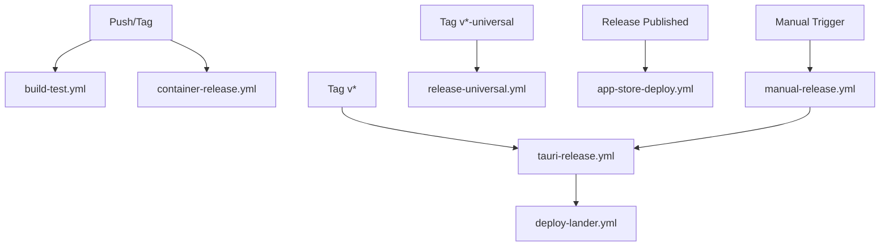

# GitHub Actions Workflows

This directory contains all GitHub Actions workflows for the ElizaOS project.

## Build & Test Workflows

### build-test.yml

- **Trigger**: Push to main, PRs, manual
- **Purpose**: Builds and tests the Tauri application across all platforms
- **Platforms**: Windows, macOS, Linux

### verify-deployment.yml

- **Trigger**: Push, PRs, manual
- **Purpose**: Verifies deployment scripts and configurations

## Release Workflows

### tauri-release.yml

- **Trigger**: Push tags (`v*`), manual
- **Purpose**: Main release workflow for desktop applications
- **Outputs**: DMG (macOS), MSI/EXE (Windows), AppImage/DEB (Linux)
- **Features**:
  - Uses official Tauri GitHub Action
  - Code signing and notarization
  - Automatic GitHub release creation
  - Integrated app store deployments (Steam, Mac App Store, Windows Store, Snap Store)
  - Supports both Intel and Apple Silicon builds for macOS

### release-universal.yml

- **Trigger**: Push tags (`v*-universal`), manual
- **Purpose**: Builds universal macOS binary (Intel + Apple Silicon)
- **Output**: Universal DMG and app bundle

### container-release.yml

- **Trigger**: Push to main, tags (`v*`), PRs
- **Purpose**: Builds and pushes OCI-compliant containers (Docker/Podman compatible)
- **Registry**: GitHub Container Registry (ghcr.io)
- **Image**: `ghcr.io/${{ github.repository }}/eliza-agent`
- **Platforms**: linux/amd64, linux/arm64

### app-store-deploy.yml

- **Trigger**: Release published, manual
- **Purpose**: Deploys to various app stores
- **Platforms**:
  - Steam (via Steamworks)
  - Microsoft Store (MSIX)
  - Mac App Store (PKG)
  - Snap Store (snap)
  - Flathub (flatpak)

## Deployment Workflows

### deploy-lander.yml

- **Trigger**: Push to main (lander changes), manual
- **Purpose**: Deploys the landing page to GitHub Pages

### manual-release.yml

- **Trigger**: Manual only
- **Purpose**: Triggers a release build with custom version

## Required Secrets

### Code Signing

- **macOS**:

  - `APPLE_CERTIFICATE` - P12 certificate for code signing
  - `APPLE_CERTIFICATE_PASSWORD` - Certificate password
  - `APPLE_SIGNING_IDENTITY` - Identity for code signing
  - `APPLE_ID` - Apple ID email
  - `APPLE_PASSWORD` - App-specific password (for Tauri action)
  - `APPLE_APP_PASSWORD` - App-specific password (for other tools)
  - `APPLE_TEAM_ID` - Developer team ID
  - `APPLE_CERTIFICATES_P12` - Certificates for app store deployment
  - `APPLE_CERTIFICATES_PASSWORD` - Password for certificates
  - `APPLE_PROVISIONING_PROFILE` - Provisioning profile for Mac App Store
  - `MAC_APP_CERT` - Mac App Store distribution certificate
  - `MAC_APP_CERT_PASSWORD` - Password for app certificate
  - `MAC_INSTALLER_CERT` - Mac installer certificate
  - `MAC_INSTALLER_CERT_PASSWORD` - Password for installer certificate
  - `MAC_PROVISIONING_PROFILE` - Provisioning profile
  - `KEYCHAIN_PASSWORD` - Temporary keychain password
  - `APPLE_ASC_PUBLIC_ID` - App Store Connect public ID
  - `APPLE_APP_ID` - App Store app ID
  - `APPLE_APP_SPECIFIC_PASSWORD` - App-specific password for uploads

- **Windows**:
  - `TAURI_SIGNING_PRIVATE_KEY` - Tauri updater private key
  - `TAURI_SIGNING_PRIVATE_KEY_PASSWORD` - Key password
  - `WINDOWS_CERT_THUMBPRINT` - Certificate thumbprint for Store
  - `AZURE_AD_TENANT_ID` - Azure AD tenant for Store API
  - `AZURE_AD_CLIENT_ID` - Azure AD client ID
  - `AZURE_AD_CLIENT_SECRET` - Azure AD client secret
  - `WINDOWS_STORE_APP_ID` - Windows Store app ID

### App Store Deployment

- **Steam**:

  - `STEAM_USERNAME` - Steam account username
  - `STEAM_PASSWORD` - Steam account password (if not using TOTP)
  - `STEAM_SHARED_SECRET` - Steam Guard shared secret (for TOTP)
  - `STEAM_CONFIG_VDF` - Steam config.vdf contents (alternative auth)
  - `STEAM_APP_ID` - Your Steam app ID

- **Microsoft Store**:

  - `MS_TENANT_ID` - Azure AD tenant ID
  - `MS_SELLER_ID` - Microsoft Partner Center seller ID
  - `MS_CLIENT_ID` - Azure AD app client ID
  - `MS_CLIENT_SECRET` - Azure AD app client secret
  - `MS_PRODUCT_ID` - Microsoft Store product ID
  - `MS_PACKAGE_NAME` - Package identity name
  - `MS_PUBLISHER` - Publisher identity (CN=...)
  - `MS_PUBLISHER_DISPLAY` - Publisher display name
  - `MS_CERTIFICATE_PATH` - Path to code signing certificate
  - `MS_CERTIFICATE_PASSWORD` - Certificate password

- **Linux Stores**:
  - `SNAPCRAFT_STORE_CREDENTIALS`

### Other

- `GITHUB_TOKEN` - Automatically provided

## Workflow Dependencies

## Best Practices

1. **Version Tags**: Use semantic versioning (e.g., `v1.0.0`)
2. **Universal Builds**: Tag with `-universal` suffix for macOS universal binaries
3. **Draft Releases**: Test workflows with draft releases first
4. **Secret Management**: Use GitHub environments for production secrets
5. **Caching**: Workflows use caching for dependencies and build artifacts

## Troubleshooting

### Build Failures

- Check platform-specific dependencies
- Verify all secrets are set correctly
- Review build logs for missing tools

### Release Issues

- Ensure tags follow correct format
- Check GitHub token permissions
- Verify artifact paths match

### App Store Deployment

- Validate credentials before deployment
- Test with development/sandbox environments first
- Monitor platform-specific requirements
