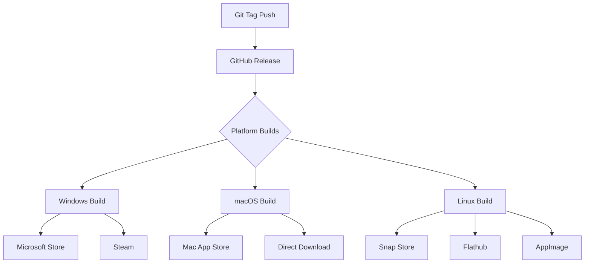

# ElizaOS App Store Deployment Guide

> **Note**: This guide is located in the `deployment/` folder. All paths mentioned are relative to the project root unless otherwise specified.

## Overview

This document provides comprehensive information about deploying ElizaOS to various app stores and distribution platforms. ElizaOS is a Tauri-based application that combines a React frontend with a Rust backend, supporting Windows, macOS, and Linux platforms.

## Current Status

### ✅ Implemented

- **GitHub Releases**: Automated builds for Windows, macOS, and Linux
- **macOS Notarization**: Apple notarization for direct distribution
- **Container Distribution**: Docker images via GitHub Container Registry
- **Direct Downloads**: Installers available from GitHub Releases

### ⚠️ Not Yet Implemented

- Steam
- Mac App Store
- Microsoft Store
- Linux App Stores (Snap Store, Flathub)

## Platform-Specific Requirements

### 1. Steam (Steamworks)

**Prerequisites:**

- Steam Developer Account ($100 one-time fee)
- App ID from Steamworks
- Steamworks SDK integration
- Steam Cloud saves support (optional)

**Technical Requirements:**

```yaml
Steam Build Requirements:
  - Binary Format: Executable with Steam API integration
  - Architecture: x86_64 (32-bit optional)
  - Steam Features:
      - Achievements API
      - Cloud Saves
      - Workshop Support (for user content)
      - Rich Presence
      - Steam Input API
```

**Implementation Steps:**

1. Create `steam_appid.txt` with your App ID
2. Integrate Steamworks SDK in Rust backend
3. Create depot build scripts
4. Set up Steam Pipe for automated uploads
5. Configure store page assets

**Required Files:**

```
steam/
├── steam_appid.txt
├── sdk/
│   ├── steamworks_sdk_*.zip
│   └── redistributable_bin/
├── scripts/
│   ├── app_build_*.vdf
│   └── depot_build_*.vdf
└── assets/
    ├── capsule_main.png (616x353)
    ├── header.jpg (460x215)
    ├── library_hero.png (1920x620)
    └── screenshots/ (1920x1080)
```

### 2. Mac App Store

**Prerequisites:**

- Apple Developer Account ($99/year)
- Valid Developer ID certificates
- App Store Connect access
- macOS-specific entitlements

**Technical Requirements:**

```yaml
Mac App Store Requirements:
  - Code Signing: Developer ID Application certificate
  - Notarization: Required for macOS 10.15+
  - Sandboxing: Full App Sandbox compliance
  - Entitlements:
      - com.apple.security.app-sandbox: true
      - com.apple.security.network.client: true
      - com.apple.security.files.user-selected.read-write: true
```

**Implementation Steps:**

1. Configure Info.plist with proper metadata
2. Enable App Sandbox in entitlements
3. Remove prohibited APIs (JIT compilation, dynamic code loading)
4. Create App Store Connect listing
5. Submit for review

**Required Modifications to `tauri.conf.json`:**

```json
{
  "macOS": {
    "category": "public.app-category.games",
    "minimumSystemVersion": "10.15",
    "entitlements": "src-tauri/entitlements-mas.plist",
    "hardenedRuntime": true,
    "provisioningProfile": "embedded.provisionprofile"
  }
}
```

### 3. Microsoft Store

**Prerequisites:**

- Microsoft Partner Center account
- Windows Developer account ($19 individual/$99 company)
- MSIX packaging
- Age rating certificate

**Technical Requirements:**

```yaml
Microsoft Store Requirements:
  - Package Format: MSIX or APPX
  - Architecture: x64, x86, ARM64
  - Windows Version: Windows 10 1809+
  - Certification: WACK (Windows App Certification Kit) pass
  - Capabilities Declaration: In manifest
```

**Implementation Steps:**

1. Convert Tauri output to MSIX package
2. Create AppxManifest.xml
3. Generate required assets (logos, tiles)
4. Run Windows App Certification Kit
5. Submit via Partner Center

**MSIX Configuration:**

```xml
<Package>
  <Identity Name="ElizaOS.Game"
            Publisher="CN=ElizaOS Team"
            Version="2.0.0.0" />
  <Properties>
    <DisplayName>ELIZA</DisplayName>
    <PublisherDisplayName>ElizaOS Team</PublisherDisplayName>
  </Properties>
  <Capabilities>
    <Capability Name="internetClient" />
    <rescap:Capability Name="runFullTrust" />
  </Capabilities>
</Package>
```

### 4. Linux App Stores

#### Snap Store (Snapcraft)

**Prerequisites:**

- Ubuntu One account
- Snapcraft CLI tools
- snapcraft.yaml configuration

**Implementation:**

```yaml
# snapcraft.yaml
name: elizaos
version: '2.0.0'
summary: Autonomous AI agent life simulation
description: |
  ELIZA is an AI sandbox life simulation game...

base: core22
confinement: strict
grade: stable

apps:
  elizaos:
    command: elizaos
    plugs:
      - network
      - opengl
      - x11
      - desktop
      - desktop-legacy

parts:
  elizaos:
    plugin: rust
    source: .
    build-packages:
      - libwebkit2gtk-4.0-dev
      - libssl-dev
```

#### Flathub (Flatpak)

**Prerequisites:**

- Flathub account
- Flatpak manifest
- Runtime dependencies

**Implementation:**

```yaml
# com.elizaos.Game.yml
app-id: com.elizaos.Game
runtime: org.freedesktop.Platform
runtime-version: '23.08'
sdk: org.freedesktop.Sdk
command: elizaos

finish-args:
  - --share=network
  - --socket=x11
  - --socket=wayland
  - --device=dri
  - --filesystem=home

modules:
  - name: elizaos
    buildsystem: simple
    build-commands:
      - install -D elizaos /app/bin/elizaos
```

## Automation Strategy

### GitHub Actions Workflows

Create deployment workflows for each platform:

```yaml
# .github/workflows/deploy-steam.yml
name: Deploy to Steam
on:
  release:
    types: [published]

jobs:
  steam-deploy:
    runs-on: ubuntu-latest
    steps:
      - uses: game-ci/steam-deploy@v1
        with:
          username: ${{ secrets.STEAM_USERNAME }}
          password: ${{ secrets.STEAM_PASSWORD }}
          appId: ${{ secrets.STEAM_APP_ID }}
          buildDescription: v${{ github.event.release.tag_name }}
```

### Multi-Store Release Pipeline



## Store Listing Requirements

### Common Assets Needed

| Asset Type    | Dimensions | Format  | Platforms       |
| ------------- | ---------- | ------- | --------------- |
| App Icon      | 512x512    | PNG     | All             |
| Hero Image    | 1920x1080  | JPG/PNG | Steam, MS Store |
| Capsule Image | 616x353    | PNG     | Steam           |
| Store Icon    | 300x300    | PNG     | Mac App Store   |
| Screenshots   | 1920x1080  | PNG     | All             |
| Trailer Video | 1920x1080  | MP4     | Steam, MS Store |

### Metadata Requirements

```yaml
Store Metadata:
  - App Name: 'ELIZA'
  - Short Description: (30 chars)
  - Long Description: (4000 chars)
  - Keywords/Tags: AI, Simulation, Sandbox, Agent
  - Category: Games/Simulation
  - Age Rating: Teen (AI interactions)
  - Privacy Policy URL: Required
  - Support URL: Required
  - System Requirements: Per platform
```

## Security & Compliance

### Code Signing Certificates

| Platform | Certificate Type | Cost                | Validity   |
| -------- | ---------------- | ------------------- | ---------- |
| Windows  | EV Code Signing  | $300-500/year       | 1-3 years  |
| macOS    | Developer ID     | $99/year (included) | 1 year     |
| Linux    | GPG Key          | Free                | Indefinite |

### Privacy & Data Handling

- GDPR compliance for EU distribution
- Data collection disclosure
- Age rating certificates (IARC, ESRB)
- Export compliance (encryption)

## Revenue & Analytics

### Platform Fees

| Store           | Revenue Share     | Payment Terms |
| --------------- | ----------------- | ------------- |
| Steam           | 70/30 (Valve/Dev) | Monthly       |
| Mac App Store   | 70/30 or 85/15    | Monthly       |
| Microsoft Store | 70/30 or 85/15    | Monthly       |
| Snap Store      | 0% (Free)         | N/A           |
| Flathub         | 0% (Donations)    | Direct        |

### Analytics Integration

```javascript
// Platform-specific analytics
const analytics = {
  steam: 'Steamworks Stats API',
  apple: 'App Store Connect Analytics',
  microsoft: 'Partner Center Insights',
  linux: 'Custom implementation',
};
```

## Implementation Timeline

### Phase 1: Foundation (2-4 weeks)

- [ ] Set up developer accounts
- [ ] Obtain code signing certificates
- [ ] Create store assets
- [ ] Write store descriptions

### Phase 2: Platform Integration (4-6 weeks)

- [ ] Steam SDK integration
- [ ] MSIX packaging setup
- [ ] Mac App Store compliance
- [ ] Linux package configurations

### Phase 3: Automation (2-3 weeks)

- [ ] GitHub Actions workflows
- [ ] Build scripts per platform
- [ ] Release automation
- [ ] Version synchronization

### Phase 4: Submission & Review (2-4 weeks)

- [ ] Platform-specific testing
- [ ] Certification compliance
- [ ] Store submissions
- [ ] Review process handling

## Testing Checklist

### Pre-Submission Testing

- [ ] Clean install on fresh OS
- [ ] Update mechanism verification
- [ ] Store-specific features (achievements, cloud saves)
- [ ] Performance benchmarks
- [ ] Accessibility compliance
- [ ] Localization testing

### Platform-Specific Tests

- [ ] **Steam**: Workshop integration, Big Picture mode
- [ ] **Mac App Store**: Sandbox restrictions, iCloud sync
- [ ] **Microsoft Store**: Xbox controller support, Windows Hello
- [ ] **Linux**: Multiple distro compatibility

## Maintenance & Updates

### Version Management

```bash
# Synchronized versioning across platforms
scripts/update-version.sh 2.1.0

# Platform-specific version formats
Steam: Major.Minor.Patch (2.1.0)
Apple: CFBundleShortVersionString (2.1.0)
Microsoft: Major.Minor.Build.Revision (2.1.0.0)
Linux: Semantic Versioning (2.1.0)
```

### Update Distribution

- **Steam**: Automatic via Steam client
- **Mac App Store**: Automatic or manual via App Store
- **Microsoft Store**: Automatic via Store app
- **Linux**: Package manager updates

## Support Infrastructure

### Per-Platform Support Channels

- Steam Community Hub & Forums
- Apple Developer Forums
- Microsoft Partner Support
- Linux Distribution Communities

### Documentation Requirements

- Platform-specific README files
- Installation guides per store
- Troubleshooting documentation
- FAQ sections

## Cost Summary

### Initial Setup Costs

| Item                 | Cost         | Frequency |
| -------------------- | ------------ | --------- |
| Steam Direct         | $100         | One-time  |
| Apple Developer      | $99          | Annual    |
| Microsoft Developer  | $19-99       | One-time  |
| Code Signing (EV)    | $300-500     | Annual    |
| **Total First Year** | **$518-798** |           |

### Ongoing Costs

| Item             | Cost         | Frequency |
| ---------------- | ------------ | --------- |
| Apple Developer  | $99          | Annual    |
| Code Signing     | $300-500     | Annual    |
| **Total Annual** | **$399-599** |           |

## Next Steps

1. **Prioritize Platforms**: Based on target audience
2. **Set Up Accounts**: Register for developer programs
3. **Prepare Assets**: Create all required graphics
4. **Implement Integration**: Platform-specific code
5. **Automate Deployment**: CI/CD pipelines
6. **Submit for Review**: Follow platform guidelines

## Resources

### Official Documentation

- [Steamworks Documentation](https://partner.steamgames.com/doc/home)
- [App Store Connect Help](https://developer.apple.com/app-store-connect/)
- [Microsoft Store Policies](https://docs.microsoft.com/windows/uwp/publish/)
- [Snapcraft Documentation](https://snapcraft.io/docs)
- [Flathub Submission](https://docs.flathub.org/docs/for-app-authors/submission)

### Tools & SDKs

- [Tauri Bundler](https://tauri.app/v1/guides/building/)
- [Steamworks SDK](https://partner.steamgames.com/downloads/)
- [Windows SDK](https://developer.microsoft.com/windows/downloads/windows-sdk/)
- [Flatpak Builder](https://docs.flatpak.org/en/latest/flatpak-builder.html)

### Community Resources

- [Tauri Discord](https://discord.com/invite/tauri)
- [Steam Developer Forums](https://steamcommunity.com/groups/steamworks/discussions/)
- [r/gamedev](https://reddit.com/r/gamedev) - Platform deployment discussions
