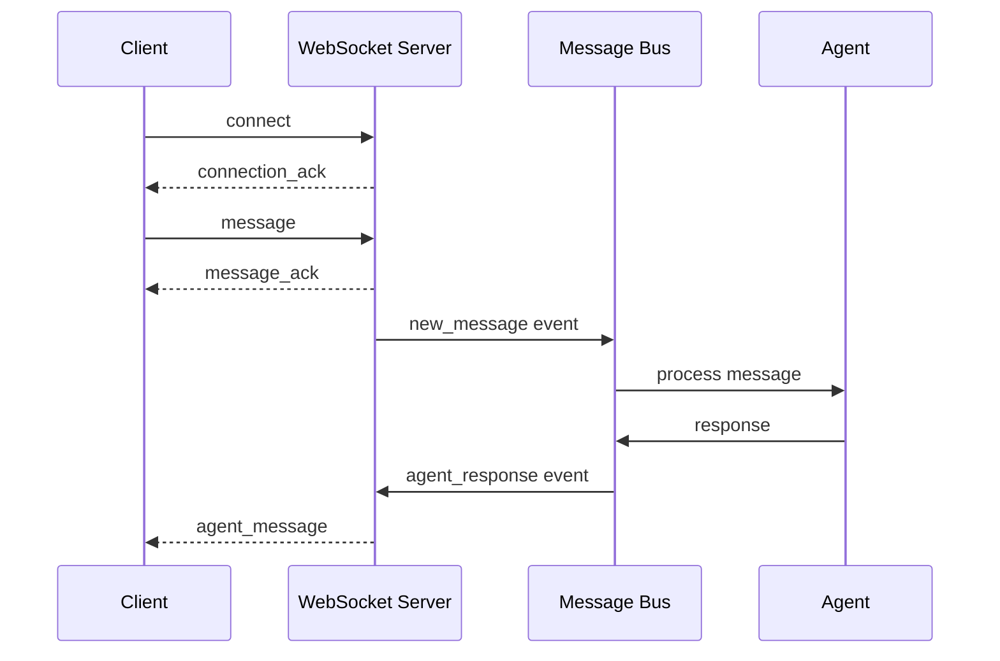

# WebSocket API Documentation

This document describes the WebSocket API for communicating with the ElizaOS agent server.

## Connection

**Endpoint**: `ws://localhost:7777/ws`

## Message Protocol

All messages are JSON-encoded and follow this general structure:

```json
{
  "type": "message_type",
  "agent_id": "agent-uuid",
  "channel_id": "channel-identifier"
  // Additional fields based on message type
}
```

## Client → Server Messages

### 1. Connect Message

Establishes a connection to a specific agent and channel.

```json
{
  "type": "connect",
  "agent_id": "2fbc0c27-50f4-09f2-9fe4-9dd27d76d46f",
  "channel_id": "unique-channel-id",
  "client_type": "web_client|mobile_client|test_client",
  "metadata": {
    "version": "1.0.0"
    // Additional client metadata
  }
}
```

**Response**: `connection_ack` message

### 2. User Message

Sends a message from the user to the agent.

```json
{
  "type": "message",
  "content": "Hello, can you help me?",
  "author": "username",
  "channel_id": "unique-channel-id",
  "agent_id": "2fbc0c27-50f4-09f2-9fe4-9dd27d76d46f",
  "timestamp": 1234567890000,
  "metadata": {
    "source": "chat",
    "request_id": "uuid-for-tracking"
  }
}
```

**Response**:

1. Immediate `message_ack` acknowledgment
2. Later `agent_message` with the agent's response

### 3. Disconnect Message

Cleanly disconnects from the channel.

```json
{
  "type": "disconnect",
  "channel_id": "unique-channel-id",
  "agent_id": "2fbc0c27-50f4-09f2-9fe4-9dd27d76d46f"
}
```

### 4. Heartbeat

Keep-alive message to maintain connection.

```json
{
  "type": "heartbeat",
  "timestamp": 1234567890000
}
```

## Server → Client Messages

### 1. Connection Acknowledgment

Confirms successful connection.

```json
{
  "type": "connection_ack",
  "channel_id": "unique-channel-id",
  "agent_id": "2fbc0c27-50f4-09f2-9fe4-9dd27d76d46f",
  "timestamp": 1234567890000
}
```

### 2. Message Acknowledgment

Confirms message was received and queued for processing.

```json
{
  "type": "message_ack",
  "message_id": "unique-message-id",
  "timestamp": 1234567890000
}
```

### 3. Agent Message

The agent's response to a user message.

```json
{
  "type": "agent_message",
  "id": "message-uuid",
  "content": "Hello! I'd be happy to help you.",
  "author": "ELIZA",
  "channel_id": "unique-channel-id",
  "timestamp": 1234567890000,
  "thought": "The user is greeting me and asking for help",
  "metadata": {
    "agentName": "ELIZA",
    "response_to": "original-message-id",
    "actions": [],
    "confidence": 0.95
  }
}
```

### 4. Error Message

Indicates an error occurred.

```json
{
  "type": "error",
  "message": "Invalid message format",
  "code": "INVALID_FORMAT",
  "details": {
    "field": "agent_id",
    "reason": "Required field missing"
  }
}
```

### 5. Status Update

Provides status information about the agent or system.

```json
{
  "type": "status",
  "status": "thinking|typing|idle",
  "channel_id": "unique-channel-id",
  "agent_id": "2fbc0c27-50f4-09f2-9fe4-9dd27d76d46f"
}
```

## Message Flow



## Error Codes

| Code             | Description                            |
| ---------------- | -------------------------------------- |
| `INVALID_FORMAT` | Message JSON is malformed              |
| `MISSING_FIELD`  | Required field is missing              |
| `INVALID_AGENT`  | Agent ID is invalid or agent not found |
| `CHANNEL_ERROR`  | Channel-related error                  |
| `RATE_LIMIT`     | Too many messages sent                 |
| `INTERNAL_ERROR` | Server-side error                      |

## Best Practices

### 1. Connection Management

- Always send a `connect` message after establishing WebSocket connection
- Wait for `connection_ack` before sending messages
- Send periodic heartbeats to keep connection alive
- Use `disconnect` message for clean shutdown

### 2. Message Handling

- Include unique IDs for message tracking
- Always include required fields
- Handle both immediate acknowledgments and delayed responses
- Implement reconnection logic for dropped connections

### 3. Error Handling

- Parse and handle error messages appropriately
- Implement exponential backoff for reconnection
- Provide user feedback for connection issues

## Example Usage

### JavaScript/TypeScript

```typescript
const ws = new WebSocket('ws://localhost:7777/ws');

ws.onopen = () => {
  // Send connect message
  ws.send(
    JSON.stringify({
      type: 'connect',
      agent_id: '2fbc0c27-50f4-09f2-9fe4-9dd27d76d46f',
      channel_id: 'my-channel',
      client_type: 'web_client',
    })
  );
};

ws.onmessage = (event) => {
  const message = JSON.parse(event.data);

  switch (message.type) {
    case 'connection_ack':
      // Connection established, can send messages
      sendMessage('Hello, ELIZA!');
      break;
    case 'agent_message':
      // Display agent response
      console.log('Agent:', message.content);
      break;
    case 'error':
      // Handle error
      console.error('Error:', message.message);
      break;
  }
};

function sendMessage(content: string) {
  ws.send(
    JSON.stringify({
      type: 'message',
      content: content,
      author: 'User',
      channel_id: 'my-channel',
      agent_id: '2fbc0c27-50f4-09f2-9fe4-9dd27d76d46f',
      timestamp: Date.now(),
    })
  );
}
```

### Python

```python
import asyncio
import json
import websockets

async def chat_with_agent():
    uri = "ws://localhost:7777/ws"

    async with websockets.connect(uri) as websocket:
        # Connect to agent
        await websocket.send(json.dumps({
            "type": "connect",
            "agent_id": "2fbc0c27-50f4-09f2-9fe4-9dd27d76d46f",
            "channel_id": "python-channel",
            "client_type": "test_client"
        }))

        # Wait for acknowledgment
        response = json.loads(await websocket.recv())
        if response["type"] == "connection_ack":
            print("Connected to agent")

            # Send a message
            await websocket.send(json.dumps({
                "type": "message",
                "content": "Hello from Python!",
                "author": "PythonUser",
                "channel_id": "python-channel",
                "agent_id": "2fbc0c27-50f4-09f2-9fe4-9dd27d76d46f",
                "timestamp": int(time.time() * 1000)
            }))

            # Listen for responses
            while True:
                message = json.loads(await websocket.recv())
                print(f"Received: {message}")

                if message["type"] == "agent_message":
                    print(f"Agent says: {message['content']}")

asyncio.run(chat_with_agent())
```

## Testing

Use the comprehensive test suite in `tests/websocket_full_flow_test.rs` to verify WebSocket functionality:

```bash
# Run WebSocket tests (requires agent server running)
cargo test --test websocket_full_flow_test -- --nocapture
```

## Troubleshooting

### Connection Refused

If you get a connection refused error:

1. Ensure the agent server is running: `cd packages/agentserver && bun run start`
2. Check that port 7777 is not blocked by firewall
3. Verify the WebSocket endpoint URL is correct

### No Agent Response

If messages are acknowledged but no agent response comes:

1. Check agent logs for errors
2. Verify the agent ID is correct
3. Ensure the agent is properly configured
4. Check that required plugins are loaded

### Dropped Connections

If connections drop frequently:

1. Implement heartbeat messages
2. Add reconnection logic with exponential backoff
3. Check network stability
4. Monitor server resources
