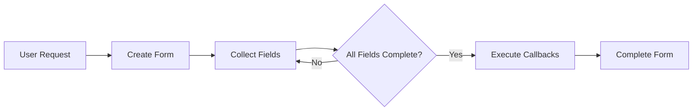

# 🗂️ ElizaOS Forms Plugin

A powerful forms management plugin for ElizaOS that enables structured data
collection through conversational interactions. This plugin allows agents to
create, manage, and process multi-step forms while maintaining natural
conversation flow.

## 🚨 TL;DR - Quick Setup

**Want your agent to collect structured data through forms? Here's the fastest
path:**

1. **Install the plugin** → `bun install @elizaos/plugin-forms`
2. **Add to your agent**:

   ```typescript
   import { formsPlugin } from '@elizaos/plugin-forms';

   const character = {
     plugins: [formsPlugin],
     // ... other config
   };
   ```

3. **Try it** → "I need to fill out a contact form"
4. **Done!** Your agent now handles forms naturally in conversation

## ✨ Features

- ✅ **Multi-Step Forms** - Create complex forms with conditional logic
- ✅ **Natural Language Processing** - Extract form values from user messages
  using LLM
- ✅ **Secret Field Handling** - Secure handling of sensitive data like API keys
- ✅ **Form Templates** - Pre-built templates for common use cases
- ✅ **Smart Validation** - Field-level validation with custom criteria
- ✅ **Extensible Callbacks** - Step and form completion hooks
- ✅ **Real-time Context** - Live form state information for agents
- ✅ **Conversational Flow** - Maintains natural dialogue while collecting data

## 📋 Prerequisites

- ElizaOS agent setup
- Node.js and bun installed
- Basic understanding of TypeScript (for custom forms)

## 🚀 Quick Start

### Step 1: Install the Plugin

```bash
bun install @elizaos/plugin-forms
```

### Step 2: Add to Your Agent

```typescript
import { formsPlugin } from '@elizaos/plugin-forms';

// In your character configuration
const character = {
  name: 'FormBot',
  plugins: [formsPlugin],
  // ... other configuration
};
```

### Step 3: Test Basic Forms

Start your agent and try these commands:

```
User: "I need to fill out a contact form"
Agent: "I've created a new contact form for you. Let's start with Basic Information.
        Please provide the following information:
        - Name: Your full name
        - Email: Your email address"

User: "My name is John Doe and my email is john@example.com"
Agent: "Form completed successfully! I've recorded:
        - Name: John Doe
        - Email: john@example.com"
```

## 🎯 Common Use Cases

### Collect Contact Information

```typescript
// User says: "I want to submit my contact details"
// Agent creates a contact form automatically
```

### API Configuration Forms

```typescript
const apiConfigForm = {
  name: 'api-config',
  steps: [
    {
      id: 'credentials',
      name: 'API Configuration',
      fields: [
        {
          id: 'apiKey',
          label: 'API Key',
          type: 'text',
          secret: true, // Value will be masked
        },
        {
          id: 'endpoint',
          label: 'API Endpoint',
          type: 'text',
        },
      ],
    },
  ],
};
```

### Multi-Step Surveys

```typescript
const surveyForm = {
  name: 'feedback-survey',
  steps: [
    {
      id: 'experience',
      name: 'Your Experience',
      fields: [
        {
          id: 'rating',
          label: 'Overall Rating',
          type: 'number',
          criteria: 'Number between 1-5',
        },
      ],
    },
    {
      id: 'details',
      name: 'Additional Details',
      fields: [
        {
          id: 'comments',
          label: 'Comments',
          type: 'textarea',
          optional: true,
        },
      ],
    },
  ],
};
```

## 📚 Core Concepts

### Field Types

```typescript
┌─────────────────────────────────────────────────┐
│ Available Field Types                           │
├─────────────────────────────────────────────────┤
│ text      → Single line text input             │
│ textarea  → Multi-line text input              │
│ number    → Numeric input                      │
│ email     → Email address validation           │
│ choice    → Selection from options             │
│ checkbox  → Boolean true/false                 │
│ date      → Date input                         │
└─────────────────────────────────────────────────┘
```

### Form Flow



## 🛠️ API Reference

### FormsService

The core service managing form lifecycle:

```typescript
class FormsService {
  // Create a new form
  createForm(templateOrDefinition): Promise<Form>;

  // Update form with user input
  updateForm(formId, message): Promise<UpdateResult>;

  // List forms by status
  listForms(status?): Promise<Form[]>;

  // Get specific form
  getForm(formId): Promise<Form>;

  // Cancel active form
  cancelForm(formId): Promise<void>;

  // Register custom template
  registerTemplate(template): void;
}
```

### Creating Custom Forms

#### Basic Form Definition

```typescript
const customForm = {
  name: 'user-profile',
  description: 'Collect user profile information',
  steps: [
    {
      id: 'basic-info',
      name: 'Basic Information',
      fields: [
        {
          id: 'username',
          label: 'Username',
          type: 'text',
          description: 'Choose a unique username',
          criteria: 'Alphanumeric, 3-20 characters',
        },
        {
          id: 'bio',
          label: 'Bio',
          type: 'textarea',
          description: 'Tell us about yourself',
          optional: true,
        },
      ],
    },
  ],
};
```

#### Advanced Features

**🔒 Secret Fields**

```typescript
{
  id: 'password',
  label: 'Password',
  type: 'text',
  secret: true,  // Value masked in outputs
  criteria: 'Minimum 8 characters',
}
```

**✅ Field Validation**

```typescript
{
  id: 'age',
  label: 'Age',
  type: 'number',
  criteria: 'Must be 18 or older',
  validate: (value) => {
    const age = parseInt(value);
    return age >= 18;
  }
}
```

**🔄 Callbacks**

```typescript
{
  steps: [{
    id: 'step1',
    name: 'Step 1',
    fields: [...],
    onComplete: async (form, stepId) => {
      console.log(`Step ${stepId} completed`);
      // Custom logic here
    }
  }],
  onComplete: async (form) => {
    console.log('Form completed:', form.id);
    // Save to database, send email, etc.
  }
}
```

## 🎮 Actions

### CREATE_FORM

Creates a new form from template or definition.

**Triggers**:

- "create form"
- "fill out"
- "questionnaire"
- "survey"
- "contact"
- "application"

### UPDATE_FORM

Updates active form with user values.

**Triggers**: Automatically when form is active

### CANCEL_FORM

Cancels the current form.

**Triggers**:

- "cancel"
- "stop"
- "abort"
- "quit"
- "exit"
- "nevermind"

## 🔧 Troubleshooting

### Form Not Creating

**Issue**: Agent doesn't create form when requested

**Solution**:

- ✅ Ensure plugin is loaded: Check logs for "Forms plugin initialized"
- ✅ Verify trigger words: Use exact phrases like "create form"
- ✅ Check character config includes the plugin

### Values Not Extracting

**Issue**: User input not being captured

**Solution**:

- ✅ Be explicit: "My email is user@example.com"
- ✅ One field at a time for complex forms
- ✅ Check field criteria matches input format

### Form Stuck on Step

**Issue**: Form won't progress to next step

**Solution**:

- ✅ Ensure all required fields are filled
- ✅ Check validation criteria
- ✅ Try "skip" for optional fields

### Secret Fields Visible

**Issue**: Sensitive data showing in responses

**Solution**:

- ✅ Set `secret: true` on sensitive fields
- ✅ Check provider implementation
- ✅ Verify latest plugin version

## 🧪 Testing

### Running Tests

```bash
# Run all tests (unit + E2E)
bun test

# Run only unit tests
bun run test:unit

# Run E2E tests directly
bun run test:e2e

# Run with coverage
bun test --coverage
```

### Test Coverage

The plugin maintains ~85% test coverage:

- ✅ Service lifecycle
- ✅ Form CRUD operations
- ✅ Multi-step progression
- ✅ Secret field handling
- ✅ Provider context
- ✅ Action execution
- ✅ Template management

### Known Issues

⚠️ The `elizaos test` command may encounter pino logger compatibility issues.
Use `bun run test:e2e` directly.

## 🔗 Integration Examples

### With Other Plugins

```typescript
// In another plugin
const formsService = runtime.getService<FormsService>('forms');

// Create configuration form
const form = await formsService.createForm({
  name: 'plugin-config',
  steps: [
    {
      id: 'settings',
      name: 'Plugin Settings',
      fields: [
        {
          id: 'apiKey',
          label: 'API Key',
          type: 'text',
          secret: true,
        },
      ],
      onComplete: async (form) => {
        // Save configuration
        const apiKey = form.steps[0].fields[0].value;
        await saveConfig({ apiKey });
      },
    },
  ],
});
```

### Custom Form Templates

```typescript
// Register reusable template
formsService.registerTemplate({
  name: 'bug-report',
  description: 'Bug report form',
  steps: [
    {
      id: 'issue',
      name: 'Issue Details',
      fields: [
        {
          id: 'title',
          label: 'Issue Title',
          type: 'text',
        },
        {
          id: 'description',
          label: 'Description',
          type: 'textarea',
        },
        {
          id: 'severity',
          label: 'Severity',
          type: 'choice',
          options: ['low', 'medium', 'high', 'critical'],
        },
      ],
    },
  ],
});
```

## 🔒 Security Best Practices

- 🔐 **Always use `secret: true`** for sensitive fields
- 🚫 **Never log secret field values**
- ✅ **Validate all inputs** before processing
- 🔄 **Clear forms after completion** to prevent data leaks
- 📝 **Audit form submissions** for compliance
- 🛡️ **Implement rate limiting** for form creation

## 📊 Performance Considerations

- Forms are stored in memory by default
- Implement persistence for production use
- Consider pagination for listing many forms
- Use callbacks efficiently to avoid blocking

## 🤝 Contributing

We welcome contributions! Please:

1. Check existing issues first
2. Follow the code style guide
3. Add tests for new features
4. Update documentation
5. Submit clear PR descriptions

## 📖 Additional Resources

- [ElizaOS Documentation](https://elizaos.github.io/eliza/)
- [Plugin Development Guide](https://elizaos.github.io/eliza/docs/plugins)
- [Forms Best Practices](https://elizaos.github.io/eliza/docs/forms)
- [API Reference](https://elizaos.github.io/eliza/api/forms)

## 📝 License

MIT - Part of the ElizaOS project
