# ElizaOS C++ Architecture Overview

**Document Version:** 1.0.0  
**Date:** December 12, 2024  
**Framework Version:** 1.0.0

## Executive Summary

ElizaOS C++ is a high-performance, event-driven cognitive agent framework implementing advanced autonomous agent capabilities through a layered architecture. This document provides comprehensive architectural documentation with formal diagrams and system component analysis.

**Key Characteristics:**
- **Technology Stack:** C++17, CMake, GoogleTest, nlohmann/json
- **Architecture Pattern:** Event-driven, layered cognitive architecture
- **Concurrency Model:** Multi-threaded with thread-safe operations
- **Memory Model:** Embedding-based semantic memory with attention allocation
- **Communication:** Inter-agent messaging with publish-subscribe patterns
- **Deployment:** Cross-platform (Linux, Windows, macOS)

---

## Table of Contents

1. [System Architecture Overview](#system-architecture-overview)
2. [Component Architecture](#component-architecture)
3. [Data Flow Diagrams](#data-flow-diagrams)
4. [Integration Boundaries](#integration-boundaries)
5. [Cognitive Processing Pipeline](#cognitive-processing-pipeline)
6. [Memory and Attention Systems](#memory-and-attention-systems)
7. [Concurrency and Threading Model](#concurrency-and-threading-model)
8. [API Surface and Interfaces](#api-surface-and-interfaces)

---

## System Architecture Overview

### High-Level System Architecture

The ElizaOS C++ framework implements a five-layer cognitive architecture, where each layer builds upon the foundations provided by lower layers.

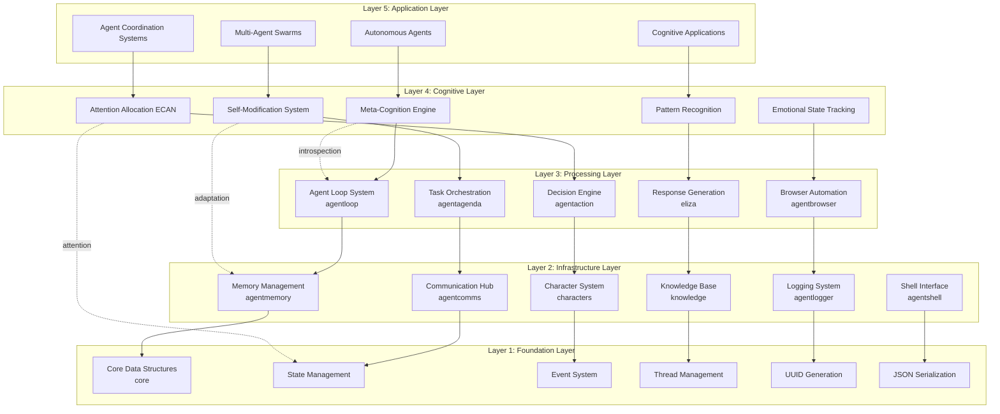

**Architectural Principles:**

1. **Layered Abstraction**: Clear separation of concerns with well-defined interfaces
2. **Emergent Intelligence**: Complex behaviors emerge from component interactions
3. **Meta-Cognitive Feedback**: Continuous self-monitoring and adaptation
4. **Thread Safety**: All operations designed for concurrent access
5. **Modular Design**: Components can be developed and tested independently

---

## Component Architecture

### Core Components Interaction

This diagram illustrates the detailed interactions between core subsystems.

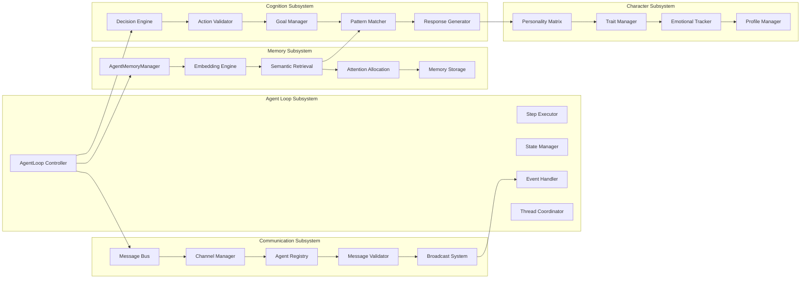

### Module Dependencies

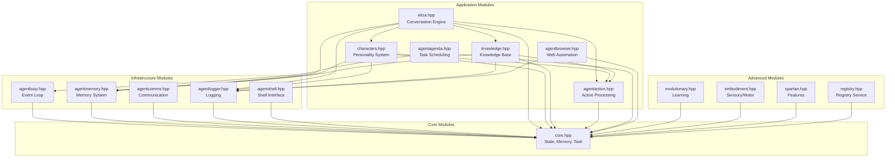

---

## Data Flow Diagrams

### Message Processing Flow

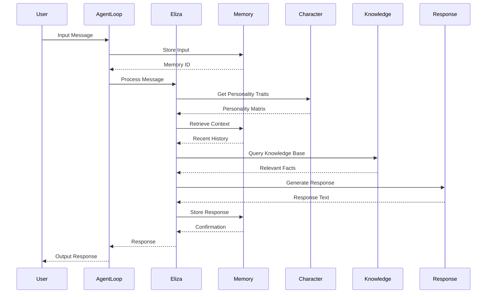

### Agent Loop Execution Flow

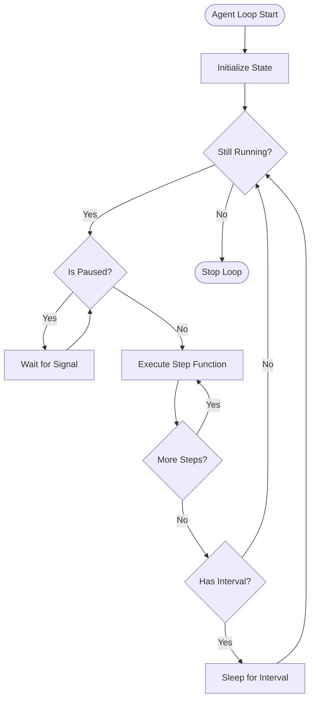

### Memory Storage and Retrieval Flow

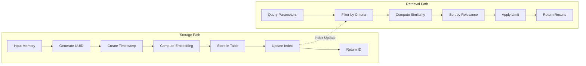

---

## Integration Boundaries

### External System Integration

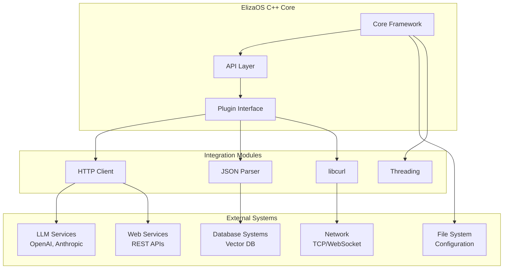

### Component Boundary Diagram

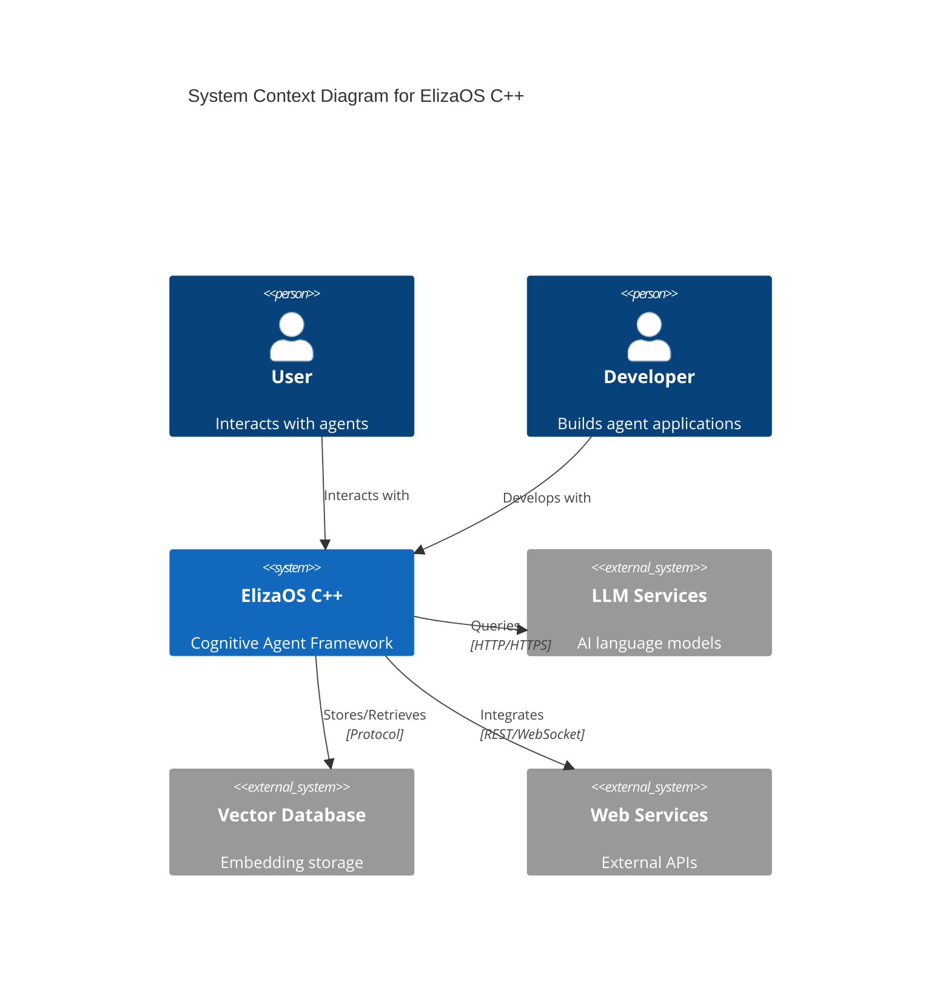

---

## Cognitive Processing Pipeline

### Cognitive Architecture

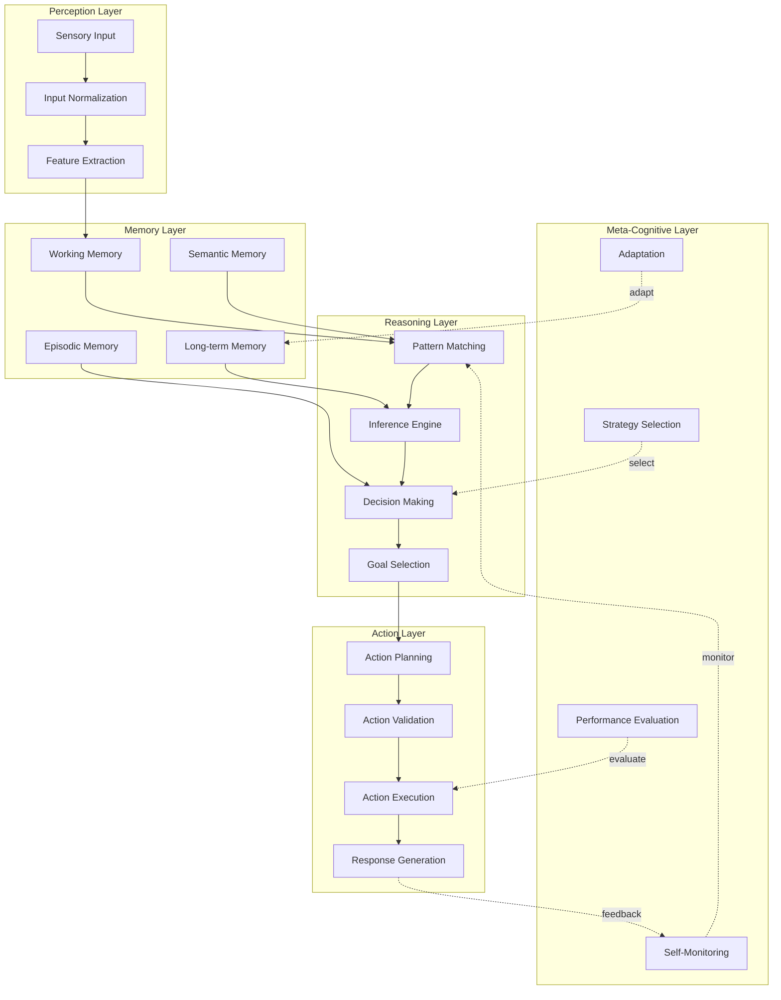

### Attention Allocation Mechanism

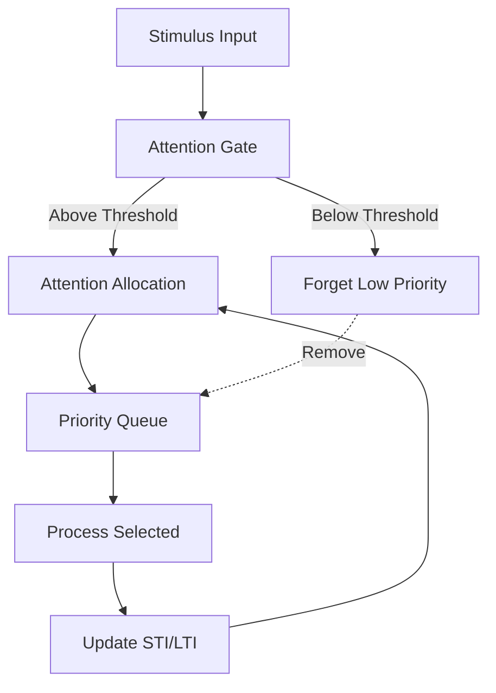

**Attention Values:**
- **STI (Short-Term Importance):** Current relevance
- **LTI (Long-Term Importance):** Historical significance
- **VLTI (Very Long-Term Importance):** Core knowledge importance

---

## Memory and Attention Systems

### Memory System Architecture

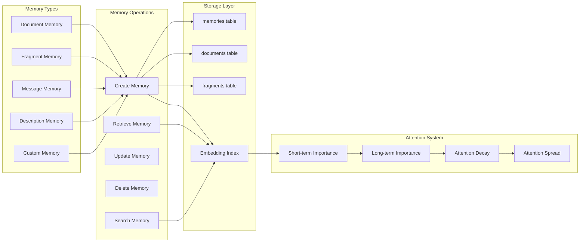

### Hypergraph Knowledge Representation

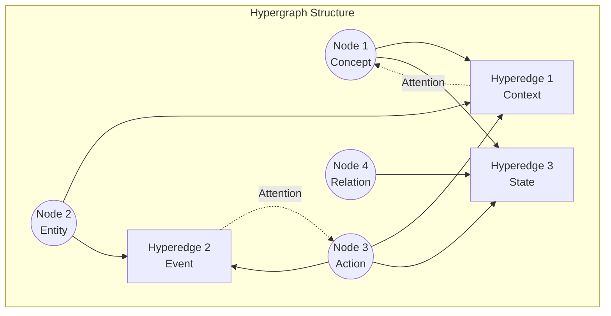

**Hypergraph Features:**
- Nodes represent concepts, entities, or actions
- Hyperedges connect multiple nodes (not just pairs)
- Enables representation of complex n-ary relationships
- Supports attention spreading across knowledge structures

---

## Concurrency and Threading Model

### Thread Architecture

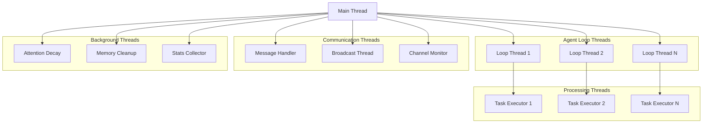

### Thread Safety Mechanisms

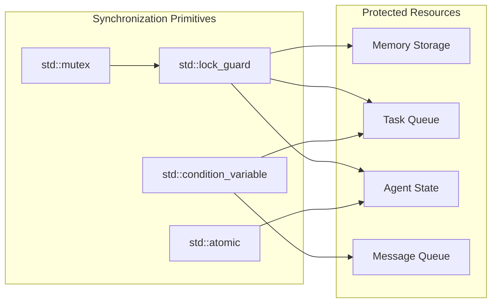

---

## API Surface and Interfaces

### Core API Classes

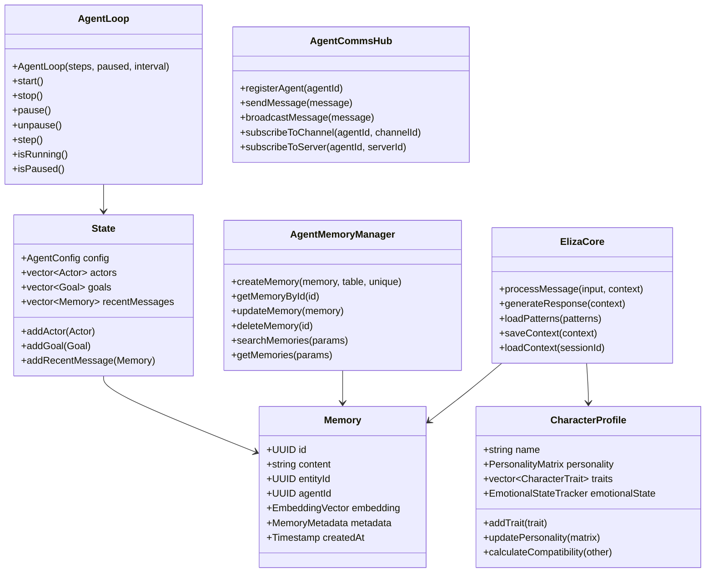

### Interface Contracts

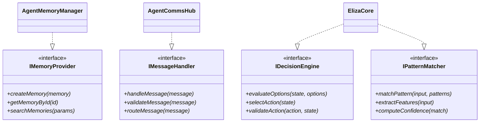

---

## Build and Deployment Architecture

### Build System

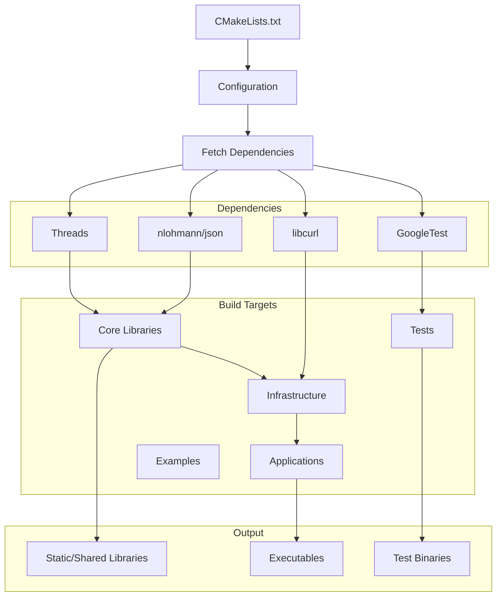

### Deployment Model

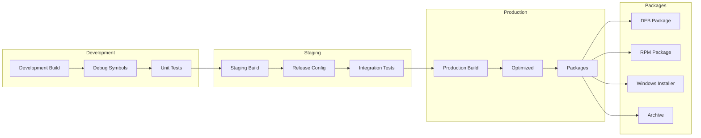

---

## Summary

This architecture overview documents the ElizaOS C++ framework as a comprehensive, production-ready cognitive agent system. The framework demonstrates:

1. **Layered Architecture**: Five distinct layers from foundation to application
2. **Event-Driven Processing**: Asynchronous, multi-threaded execution model
3. **Cognitive Capabilities**: Memory, attention, reasoning, and meta-cognition
4. **Integration Ready**: Well-defined boundaries for external system integration
5. **Production Quality**: Thread-safe, tested, and optimized for performance

The architecture supports building sophisticated autonomous agents capable of:
- Natural language conversation with personality
- Knowledge management and semantic search
- Multi-agent coordination and communication
- Self-modification and adaptive behavior
- Web automation and external system integration

**Next Steps:**
- Review formal Z++ specifications in accompanying documents
- Explore implementation details in component-specific documentation
- Reference API documentation for integration guidance
