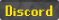
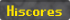

# RS-SDK

Research-oriented starter kit for runescape-style bots, including a typescript sdk, agent documentation and bindings, and a server emulator. Works out of the box - tell it what to automate!

<div align="center">
    
</div>

[](https://discord.gg/3DcuU5cMJN)
[](https://rs-sdk-demo.fly.dev/hiscores)

## Quick Start

```sh
git clone https://github.com/MaxBittker/rs-sdk.git
cd rs-sdk
```

Add your LLM API key to `.env` (only one is needed):

```sh
# .env
GROQ_API_KEY=gsk_...        # fastest + free tier
OPENAI_API_KEY=sk-...        # or
ANTHROPIC_API_KEY=sk-ant-... # or
```

Install and run:

```sh
bun install
bun run dev
```

That's it. The bot will connect to the demo server, validate your API key, and start playing.

> Keys are smoke-tested on startup. If one is invalid you'll see a clear error with instructions instead of silent 401 spam.

## What `bun run dev` starts

| Service | Description |
|---------|-------------|
| **Engine** | 2004scape game server emulator |
| **Gateway** | WebSocket router between bot clients and SDK |
| **Agent** | ElizaOS agent that observes game state and takes actions via LLM |

All three start in parallel with watch mode. Edit code, it reloads.

## Running just the agent (against the demo server)

If you don't need a local game server, you can run just the agent:

```sh
bun run start
```

This connects to the hosted demo server at `rs-sdk-demo.fly.dev`.

## Project Structure

```
.
├── run.ts              # Agent entry point (ElizaOS + RS-SDK plugin)
├── plugin/             # ElizaOS plugin: actions, providers, services
├── sdk/                # Bot SDK: WebSocket client, pathfinding, types
├── gateway/            # WebSocket router (bot <-> SDK)
├── engine/             # 2004scape game server (TypeScript)
├── webclient/          # Web-based game client
├── vendor/             # WASM pathfinder
└── content/            # Game data (maps, configs, scripts)
```

All subdirectories with a `package.json` are Bun workspaces. A single `bun install` at the root handles everything.

## How It Works

The SDK can't talk directly to the game server. Instead:

1. A **web client** (`webclient`) connects to the game server and relays game state
2. The **gateway** routes messages between web clients and SDK instances by username
3. The **SDK** receives world state and sends actions (e.g. `walkTo(x,y)`, `attackNpc("Goblin")`)
4. The **agent** (`run.ts`) uses ElizaOS to run the loop: providers (game state) -> LLM -> actions -> evaluators

The web client launches automatically when a bot connects if one isn't already running.

## Gameplay Modifications

This server has a few modifications from the original game to make bot development easier:

- **Faster leveling** - XP curve is accelerated and less steep
- **Infinite run energy** - Players never run out of energy
- **No random events** - Anti-botting random events are disabled

There is a [leaderboard](https://rs-sdk-demo.fly.dev/hiscores) for bots on the demo server, ranked by highest total level per lowest account playtime.

## Configuration

Environment variables in `.env`:

| Variable | Default | Description |
|----------|---------|-------------|
| `GROQ_API_KEY` | - | Groq API key (fastest, has free tier) |
| `OPENAI_API_KEY` | - | OpenAI API key |
| `ANTHROPIC_API_KEY` | - | Anthropic API key |
| `BOT_NAME` | `testbot` | Bot username on the game server |
| `AUTONOMY_INTERVAL_MS` | `30000` | Milliseconds between autonomous steps |
| `BUILD_JAVA_PATH` | `java` | Java 17 path (only needed for engine) |

## Credits

> RS-SDK is a fork of the LostCity engine/client, an amazing project without which this would not be possible.
> Find their [code here](https://github.com/LostCityRS/Server) or read their [history and ethos](https://lostcity.rs/t/faq-what-is-lost-city/16)

## Disclaimer

This is a free, open-source, community-run project for education and scientific research.

LostCity Server was written from scratch after many hours of research and peer review. Everything is completely and transparently open source.

We have not been endorsed by, authorized by, or officially communicated with Jagex Ltd. You cannot play Old School RuneScape here, buy RuneScape gold, or access any official game services. Bots developed here will not work on official game servers.

## License

[MIT License](LICENSE)
