# Eliza MCP Gateway

A **production-ready MCP (Model Context Protocol) gateway** that aggregates multiple MCP servers into a unified interface with **complete x402 blockchain payment support**. Enables AI agents to autonomously pay for tools and services while allowing gateway operators to monetize MCP tool access.

## 🚀 Core Features

### Gateway Capabilities
- **🔄 Multi-Server Aggregation**: Connect to unlimited MCP servers simultaneously
- **🏷️ Automatic Namespacing**: Prevents tool/resource/prompt name conflicts
- **🚀 Multi-Transport Support**: STDIO, HTTP, SSE, WebSocket - mix and match
- **💪 Health Monitoring**: Automatic reconnection and health checks
- **🛡️ Conflict Resolution**: Intelligent handling of duplicate tool names
- **🧩 Resource & Prompt Resolution**: Optional conflict resolution for resources and prompts
- **⚡ Dynamic Discovery**: Real-time capability updates and registry refresh
- **📋 Configuration-Based**: YAML/JSON configuration for easy management
- **🔐 Env Var Interpolation**: Use `${VAR}` and `${VAR:-default}` in config files

### Payment & Monetization
- **💰 x402 Blockchain Payments**: Full EIP-712 signature validation with USDC
- **🔑 API Key Authentication**: Tiered access with custom pricing
- **🌐 HTTP/SSE Transport**: Proper 402 status codes for payment challenges
- **✅ Facilitator Integration**: Official x402.org verification and settlement
- **💸 Three Payment Modes**: Passthrough, Markup, Absorb
- **📊 Flexible Pricing**: Per-tool, per-server, or global defaults
- **🧪 Testnet Ready**: Base Sepolia support for safe testing
- **↗️ Outbound x402 Payments**: Automatic downstream payments via x402-axios
- **👛 Server Wallet Overrides**: Per-server `paymentWallet` setting for fine control

---

## 💰 How MCP Monetization Works

The gateway enables **monetization of MCP tools** using blockchain payments and API keys. Here's how it works:

### Architecture Overview

```
┌──────────────────┐
│   AI Agent       │  Anthropic Claude, OpenAI, etc.
│  (with wallet)   │  Uses x402-fetch or x402-axios
│  or API key      │  Sends Authorization/X-ELIZA-API-KEY headers
└────────┬─────────┘
         │ MCP Protocol
         │ Auto-pays on HTTP 402 or API key auth
         ↓
┌──────────────────┐
│  HTTP Wrapper    │  Port 8000 (optional, for payments)
│  402 Gateway     │  • Returns HTTP 402 (x402 payments)
└────────┬─────────┘  • Validates API keys (tiered pricing)
         │ OR         • Verifies payments with facilitator
┌──────────────────┐  • Settles blockchain transactions
│  STDIO Gateway   │  Direct MCP (no payment/API key support)
└────────┬─────────┘
         │
         │ MCP Protocol (authenticated)
         ↓
┌──────────────────┐
│  Gateway Core    │  • Payment verification (x402 + API keys)
│                  │  • Tool routing
│                  │  • Namespace management
└────────┬─────────┘
         │
         ├─→ Free MCP Server (CoinGecko, filesystem, etc.)
         ├─→ Paid MCP Server (MCPay, premium APIs)
         └─→ Your Custom MCP Server
```

### Payment Flow (x402)

**Step 1: Client Requests Tool**
```http
POST http://localhost:8000/message
Content-Type: application/json

{"method": "tools/call", "params": {"name": "crypto:get_search"}}
```

**Step 2: Gateway Returns 402 (Payment Required)**
```http
HTTP/1.1 402 Payment Required
Content-Type: application/json
X-Accept-Payment: {...}

{
  "x402Version": 1,
  "accepts": [{
    "scheme": "exact",
    "network": "base-sepolia",
    "maxAmountRequired": "10000",
    "resource": "http://localhost:8000/message",
    "payTo": "0xYourAddress",
    "asset": "0x036CbD...USDC",
    "extra": {"name": "USDC", "version": "2"}
  }]
}
```

**Step 3: Agent Creates Payment (Automatic)**
- Agent's x402-fetch/x402-axios intercepts 402
- Creates EIP-712 signature with wallet
- Signs USDC transfer authorization
- Encodes payment as base64

**Step 4: Agent Retries with Payment**
```http
POST http://localhost:8000/message
X-PAYMENT: <base64-encoded-payment-signature>

{"method": "tools/call", "params": {"name": "crypto:get_search"}}
```

**Step 5: Gateway Verifies & Settles**
- Decodes payment signature
- Verifies with x402 facilitator
- Settles transaction on blockchain
- Forwards request to downstream MCP server

**Step 6: Tool Executes**
- MCP server processes request
- Returns result to gateway
- Gateway forwards to client

### Payment Modes

#### 1. **Passthrough Mode** 🔄
**Use Case**: Aggregate paid MCP servers, earn discovery fees

```yaml
servers:
  - name: "mcpay-server"
    transport:
      type: "http"
      url: "https://paid-api.com"
    paymentMode: "passthrough"
```

**Flow**: Client Payment → Gateway (takes fee) → Downstream Server
**Revenue**: Discovery/routing fees, no downstream costs

#### 2. **Markup Mode** 💰
**Use Case**: Resell paid APIs with margin

```yaml
payment:
  enabled: true
  recipient: "0xYourWallet"
  outboundWallet: "0xYourPrivateKey"

servers:
  - name: "premium-api"
    paymentMode: "markup"
    markup: "20%"
```

**Flow**: Client pays (downstream + 20%) → Gateway verifies → Gateway pays downstream → Earn 20% margin
**Revenue**: Percentage markup on every transaction

#### 3. **Absorb Mode** 🎁
**Use Case**: Subscription/membership model

```yaml
payment:
  enabled: true
  outboundWallet: "0xYourPrivateKey"
  apiKeys:
    - key: "premium_subscriber"
      tier: "premium"

servers:
  - name: "expensive-api"
    paymentMode: "absorb"
    defaultPricing:
      apiKeyTiers:
        premium: "free"
      x402: "$1.00"
```

**Flow**: Client authenticated with API key → Gateway pays all downstream costs → Subscription revenue
**Revenue**: Monthly/annual subscriptions, unlimited usage

### Pricing Models

#### Per-Tool Pricing
```yaml
servers:
  - name: "myserver"
    tools:
      - name: "basic-tool"
        pricing:
          free: true
      - name: "premium-tool"
        pricing:
          x402: "$0.10"
          apiKeyTiers:
            basic: "$0.05"
            premium: "free"
```

#### Server-Wide Default Pricing
```yaml
servers:
  - name: "myserver"
    defaultPricing:
      x402: "$0.01"
```

#### Mixed Strategy
```yaml
servers:
  - name: "freemium-server"
    defaultPricing:
      x402: "$0.01"
    tools:
      - name: "premium-feature"
        pricing:
          x402: "$1.00"
      - name: "free-sample"
        pricing:
          free: true
```

---

## 📦 Installation

Run directly from the repository with Bun:

```bash
# Clone the repository
git clone https://github.com/elizaOS/mcp-gateway.git
cd mcp-gateway

# Install dependencies
bun install

# Run the gateway
bun run src/index.ts --config=config.yaml
```

Or use the package scripts:
```bash
bun run start --config=config.yaml --port=8000
```

### With x402 Support (HTTP/SSE Mode)

```bash
# Install dependencies
bun install

# Start HTTP wrapper with x402 support
bun run src/transports/http-wrapper.ts --config=your-config.yaml --port=8000
```

This exposes:
- **SSE endpoint**: `http://localhost:8000/sse`
- **Message endpoint**: `http://localhost:8000/message`
- **Supports**: HTTP 402 status codes, x402 payments, API keys

## 🔧 Configuration

### Basic Configuration (Free)

```yaml
name: "Development MCP Gateway"
version: "1.0.0"

servers:
  # Local STDIO server
  - name: "filesystem"
    transport:
      type: "stdio"
      command: "npx"
      args: ["-y", "@modelcontextprotocol/server-filesystem", "/tmp"]
    namespace: "fs"
    enabled: true

  # Remote SSE server  
  - name: "coingecko"
    transport:
      type: "sse"
      sseUrl: "https://mcp.api.coingecko.com/sse"
      postUrl: "https://mcp.api.coingecko.com/message"
    namespace: "crypto"
    enabled: true

settings:
  enableToolConflictResolution: true
  enableResourceConflictResolution: true
  enablePromptConflictResolution: true
  logLevel: "info"
  healthCheckInterval: 60000
  maxConcurrentConnections: 10
```

### With Payment Gating (Monetization)

```yaml
name: "Paid MCP Gateway"
version: "1.0.0"

# Payment Configuration
payment:
  enabled: true
  recipient: "0xYourEthereumAddress"
  network: "base-sepolia"  # or "base" for mainnet
  facilitator: "https://x402.org/facilitator"
  
  # Optional: API keys for subscription model
  apiKeys:
    - key: "eliza_premium_abc123"
      tier: "premium"
    - key: "eliza_basic_xyz789"
      tier: "basic"

servers:
  - name: "coingecko"
    transport:
      type: "sse"
      sseUrl: "https://mcp.api.coingecko.com/sse"
      postUrl: "https://mcp.api.coingecko.com/message"
    namespace: "crypto"
    
    # Charge $0.01 per tool call
    defaultPricing:
      x402: "$0.01"
      apiKeyTiers:
        premium: "free"
        basic: "$0.005"
    
    # Or per-tool pricing
    tools:
      - name: "get_search"
        pricing:
          x402: "$0.02"
      - name: "get_simple_price"
        pricing:
          free: true

settings:
  logLevel: "info"
```

### With Downstream Payment (Passthrough/Markup)

```yaml
payment:
  enabled: true
  recipient: "0xYourWallet"
  network: "base"
  
  # Wallet for paying downstream services
  outboundWallet: "0xYourPrivateKey"

servers:
  # Passthrough mode - forward client payments
  - name: "mcpay-search"
    transport:
      type: "http"
      url: "https://mcpay.tech/search"
    paymentMode: "passthrough"
    
  # Markup mode - add 20% margin
  - name: "premium-api"
    transport:
      type: "http"
      url: "https://premium-api.com"
    paymentMode: "markup"
    markup: "20%"
    # Optional: override wallet just for this server
    paymentWallet: "0xServerSpecificPrivateKey"
    
  # Absorb mode - subscription model
  - name: "subscriber-api"
    transport:
      type: "http"
      url: "https://expensive-api.com"
    paymentMode: "absorb"
    defaultPricing:
      apiKeyTiers:
        premium: "free"
```

### Configuration Reference

**Payment Fields:**
- `payment.enabled`: Enable payment gating (true/false)
- `payment.recipient`: Your Ethereum address for receiving payments
- `payment.network`: Blockchain network (`base-sepolia`, `base`, `ethereum`)
- `payment.facilitator`: x402 facilitator URL (default: `https://x402.org/facilitator`)
- `payment.outboundWallet`: Private key for paying downstream (markup/absorb modes)
- `payment.apiKeys`: Array of API keys with tiers

**Server Fields:**
- `transport.type`: `stdio`, `http`, `sse`, or `websocket`
- `namespace`: Prefix for tool names (prevents conflicts)
- `paymentMode`: `passthrough`, `markup`, or `absorb`
- `markup`: Percentage (`20%`) or fixed amount (`$0.05`)
- `defaultPricing`: Server-wide pricing defaults
- `tools`: Per-tool configuration and pricing
- `paymentWallet`: Private key override for outbound payments for this server
- `timeout`, `retryAttempts`, `retryDelay`: Connection stability controls

**Pricing Fields:**
- `x402`: Price for blockchain payments (e.g., `$0.01`)
- `apiKeyTiers`: Tier-specific pricing (`{"premium": "free", "basic": "$0.05"}`)
- `free`: Mark tool as free (true/false)

### Environment Variable Interpolation

You can reference environment variables directly inside YAML/JSON configs:

```yaml
payment:
  enabled: true
  recipient: "${RECIPIENT_ADDRESS}"
  network: "${NETWORK:-base-sepolia}"
servers:
  - name: "filesystem"
    transport:
      type: "stdio"
      command: "${MCP_COMMAND:-npx}"
      args: ["-y", "@modelcontextprotocol/server-filesystem", "${MCP_FS_ROOT:-/tmp}"]
```

Supported formats: `${VAR}` and `${VAR:-default}`.

## 🎯 Usage

### 1. STDIO Mode (Claude Desktop, Cursor)

**Free, no payments:**

```bash
# Start gateway in STDIO mode
bun run src/index.ts --config=config.yaml --mode=stdio
```

**Claude Desktop configuration:**
```json
{
  "mcpServers": {
    "mcp-gateway": {
      "command": "bun",
      "args": ["run", "/path/to/mcp-gateway/src/index.ts", "--config", "/path/to/config.yaml", "--mode", "stdio"]
    }
  }
}
```

### 2. HTTP/SSE Mode (AI Agents with Payments)

**With x402 payment support:**

```bash
# Start HTTP wrapper with x402
bun run src/transports/http-wrapper.ts --config=paid-config.yaml --port=8000
```

**Agents connect to:**
- SSE endpoint: `http://localhost:8000/sse`
- Message endpoint: `http://localhost:8000/message`

**Client integration:**
```typescript
import { createMCPClient } from 'ai';
import { SSEClientTransport } from '@modelcontextprotocol/sdk/client/sse.js';
import { wrapFetchWithPayment } from 'x402-fetch';
import { privateKeyToAccount } from 'viem/accounts';

// Setup wallet for payments
const account = privateKeyToAccount('0xYourPrivateKey');
const fetchWithPayment = wrapFetchWithPayment(fetch, account);

// Create MCP client with payment support
const mcpClient = await createMCPClient({
  transport: new SSEClientTransport(
    new URL('http://localhost:8000/sse'),
    { fetch: fetchWithPayment }
  )
});
```

### 3. Environment Variables

- `MCP_GATEWAY_NAME` - Gateway name (default: "Eliza MCP Gateway")
- `MCP_GATEWAY_VERSION` - Gateway version (default: "1.0.0")
- `MCP_GATEWAY_DESCRIPTION` - Description shown to clients
- `MCP_LOG_LEVEL` - Log level: error, warn, info, debug (default: info)
- `MCP_SERVERS` - Semicolon-separated server specs
- `MCP_ENABLE_TOOL_CONFLICT_RESOLUTION` - Enable tool conflict resolution (default: true)
- `MCP_ENABLE_RESOURCE_CONFLICT_RESOLUTION` - Enable resource conflict resolution (default: true)
- `MCP_ENABLE_PROMPT_CONFLICT_RESOLUTION` - Enable prompt conflict resolution (default: true)
- `MCP_MAX_CONCURRENT_CONNECTIONS` - Max concurrent server connections (default: 10)
- `MCP_HEALTH_CHECK_INTERVAL` - Health check interval in ms (default: 60000)

## 🚀 Transport Support

### **Fully Supported Transports:**

- **📟 STDIO Transport** - Local MCP servers via stdin/stdout
  - Perfect for command-line MCP servers, Claude Desktop, Cursor
  - Configuration: `command`, `args`, `env`, `cwd`

- **🌐 HTTP Transport** - Remote MCP servers via HTTP/HTTPS
  - For web-based MCP servers and API integrations
  - Configuration: `url`, `apiKey`, `headers`

- **📡 SSE Transport** - Server-Sent Events for streaming
  - Real-time streaming capabilities
  - Configuration: `sseUrl`, `postUrl`, `apiKey`, `headers`

- **🔌 WebSocket Transport** - Real-time bidirectional communication
  - Low-latency, persistent connections
  - Configuration: `url`, `apiKey`, `headers`

```yaml
# Modern transport configuration
servers:
  # Local STDIO server
  - name: "local-server"
    transport:
      type: "stdio"
      command: "npx"
      args: ["-y", "user-review-mcp"]
    
  # Remote HTTP server
  - name: "remote-server"
    transport:
      type: "http"
      url: "https://mcp.example.com/api"
      apiKey: "YOUR_API_KEY"
    
  # Legacy format (still supported)
  - name: "legacy-server"
    command: "npx"
    args: ["-y", "@upstash/context7-mcp"]
```

### **Working Examples:**

See the `examples/` directory for complete, tested configurations:
- [`examples/mixed-transports.yaml`](examples/mixed-transports.yaml) - STDIO + HTTP combination
- [`examples/http-remote.yaml`](examples/http-remote.yaml) - Pure HTTP setup
- [`examples/future-multi-transport.yaml`](examples/future-multi-transport.yaml) - All 4 transport types
- [`examples/config.yaml`](examples/config.yaml) - Basic STDIO configuration
- [`examples/paid-config.yaml`](examples/paid-config.yaml) - x402 + API key pricing
- [`examples/passthrough-config.yaml`](examples/passthrough-config.yaml) - Pure passthrough routing
- [`examples/hybrid-payment-config.yaml`](examples/hybrid-payment-config.yaml) - Mixed payment strategies
- [`examples/absorb-config.yaml`](examples/absorb-config.yaml) - Subscription model (absorb)
- [`examples/coingecko-wrapper-config.yaml`](examples/coingecko-wrapper-config.yaml) - HTTP wrapper for CoinGecko

## 🧪 Testing

The gateway includes a comprehensive End-to-End test suite that validates all functionality across different configurations and transport types.

### Quick Testing (Recommended)
```bash
# Run essential tests (fastest)
bun run test:quick
```

### Full Test Suite
```bash
# Run all tests including payment tests
bun run test:all

# Or run test suites individually:
bun run test:quick   # Quick smoke tests (~45s)
bun run test         # Full E2E tests (~180s)
bun run test:payment # Payment E2E tests (~31s)
bun run test:passthrough # Passthrough/Markup/Absorb E2E tests
```

### Test Specific Configurations
```bash
# Test with specific config
bun run start --config=tests/configs/basic.yaml

# Available test configs:
# Core functionality:
# - basic.yaml - Single server, STDIO transport
# - basic.json - Same as basic.yaml but JSON format
# - namespaced.yaml - Single server with namespace
# - multi-server.yaml - Multiple servers, different namespaces
# - invalid.yaml - Invalid config for error testing
# - failing-server.yaml - Server connection failure testing
#
# Payment features:
# - paid-free-tools.yaml - Mix of free and paid tools
# - paid-api-key-only.yaml - API key authentication only
# - paid-x402-only.yaml - x402 blockchain payments only
# - paid-default-pricing.yaml - Server-wide default pricing
# - paid-disabled.yaml - Payment disabled (backward compatibility)
```

### Interactive Testing
```bash
# Manual testing with MCP Inspector
npx @modelcontextprotocol/inspector bun run src/index.ts --config=examples/config.yaml
```

### Test Coverage
The E2E test suite validates:
- ✅ **Configuration Loading**: YAML, JSON, and environment variables
- ✅ **All Transport Types**: STDIO, HTTP, SSE, WebSocket
- ✅ **Multi-Server Support**: Multiple servers with namespace handling
- ✅ **Payment Features**: x402 verification, API keys, tiered pricing
- ✅ **Error Handling**: Invalid configs, connection failures, graceful degradation
- ✅ **Tool Execution**: MCP protocol communication and tool calls
- ✅ **Process Management**: Startup, shutdown, cleanup

**Latest Test Results:**
- Quick E2E: ✅ 9/9 passed (~17s)
- Full E2E: ✅ Comprehensive suite available
- Payment E2E: ✅ Payment verification tests
- Passthrough E2E: ✅ Payment mode tests
- **Success Rate: 100%**

### CI/CD Integration
```bash
# For continuous integration pipelines
bun run test:quick  # Fast, essential tests only
bun run test:all    # Complete test suite
```

See `tests/README.md` for the detailed testing guide.

## 📊 Example Output

When running with multiple servers, you'll see:

```
[INFO] Starting Eliza MCP Gateway Server: Development MCP Gateway v1.0.0
[INFO] Initializing 2 servers...
[INFO] Successfully initialized server context7
[INFO] Successfully initialized server user-review  
[INFO] Initialized 2/2 servers successfully
[INFO] Registry refreshed: 3 tools, 0 resources, 0 prompts
[INFO] === Eliza MCP Gateway Status ===
[INFO] Server Connections: 2/2 active
[INFO] Tools by Server:
[INFO]   - context7: 2 tools
[INFO]   - user-review: 1 tools
```

Available tools with namespacing:
- `docs:resolve-library-id` (Context7)
- `docs:get-library-docs` (Context7) 
- `review:get-user-review` (User Review MCP)


## 🏗️ Architecture

### High-Level System Architecture

```
┌─────────────────────────────────────────────────────────┐
│                     AI Agents / Clients                  │
│  (Claude Desktop, Cursor, Custom Agents, AI Frameworks) │
└──────────────────────┬──────────────────────────────────┘
                       │
        ┌──────────────┴──────────────┐
        │                             │
   STDIO Mode                    HTTP/SSE Mode
  (No Payments)                (With x402 Payments)
        │                             │
        │                     ┌───────┴────────┐
        │                     │  HTTP Wrapper  │
        │                     │  Port 8000     │
        │                     │  • Returns 402 │
        │                     │  • Verifies x402
        │                     │  • Settles txn │
        │                     └───────┬────────┘
        │                             │
        └──────────────┬──────────────┘
                       │
              ┌────────┴────────┐
              │  Gateway Core   │
              │  • Registry     │
              │  • Routing      │
              │  • Namespacing  │
              └────────┬────────┘
                       │
        ┌──────────────┼──────────────┐
        │              │              │
   ┌────┴────┐   ┌────┴────┐   ┌────┴────┐
   │ STDIO   │   │  HTTP   │   │   SSE   │
   │ Server  │   │ Server  │   │  Server │
   └─────────┘   └─────────┘   └─────────┘
     Local         Remote        Streaming
```

### Transport Wrapper Options

- **HTTP Wrapper (`src/transports/http-wrapper.ts`)**: Spawns the stdio gateway per SSE session, handles HTTP/SSE endpoints, returns HTTP 402 for payments, and injects request headers into MCP messages for verification.
- **SSE Server Transport (`src/transports/sse-server.ts`)**: Alternative built-in SSE/HTTP transport that can host the MCP server directly with CORS and header handling. Useful when you don’t want a subprocess per session.

Both wrappers inject inbound HTTP headers into MCP request params as metadata so the gateway core can verify payments.

### Header Propagation and Verification

1. Client sends HTTP request with headers (e.g., `X-PAYMENT`, `X-ELIZA-API-KEY`).
2. Wrapper injects headers into MCP params as `_meta.headers`.
3. Gateway core retrieves headers from `request.params._meta.headers`.
4. `PaymentMiddleware.verifyPayment()` authorizes via API key or x402, or returns requirements for a 402 challenge.
5. On success, request routes to the correct downstream MCP server.

### Complete Payment Flow

```mermaid
sequenceDiagram
    participant Agent as AI Agent<br/>(x402-fetch)
    participant Wrapper as HTTP Wrapper<br/>(Port 8000)
    participant PM as Payment<br/>Middleware
    participant Facilitator as x402.org<br/>Facilitator
    participant Gateway as Gateway Core<br/>(stdio)
    participant MCP as Downstream<br/>MCP Server

    Agent->>Wrapper: POST /message (CallTool)
    Wrapper->>PM: Check payment required?
    PM-->>Wrapper: Yes, $0.01 required
    
    Wrapper-->>Agent: 402 Payment Required<br/>+ payment requirements
    
    Note over Agent: x402-fetch intercepts 402<br/>Creates EIP-712 signature<br/>Signs USDC authorization
    
    Agent->>Wrapper: POST /message + X-PAYMENT header
    Wrapper->>PM: Decode & verify payment
    PM->>Facilitator: Verify signature
    Facilitator-->>PM: ✅ Valid, payer verified
    PM->>Facilitator: Settle transaction
    Facilitator-->>PM: ✅ Settlement queued
    PM-->>Wrapper: ✅ Payment authorized
    
    Wrapper->>Gateway: Forward CallTool (stdio)
    Gateway->>MCP: Execute tool
    MCP-->>Gateway: Tool result
    Gateway-->>Wrapper: MCP response
    Wrapper-->>Agent: Tool result (SSE stream)
```



### Payment Modes at a Glance

- **Passthrough**: Client pays upstream provider directly. Wrapper/gateway returns 402 and forwards/accepts x402 headers as needed; pricing is defined by the upstream. Use when aggregating already-paid MCP servers.
- **Markup**: Client pays your gateway price; gateway calculates final price and pays the upstream via outbound wallet if needed. Use `payment.outboundWallet` (global) or `paymentWallet` (per server) to control the paying account.
- **Absorb**: Client authenticates (e.g., API key tier free), and gateway pays all downstream costs using outbound wallet. Useful for subscriptions.

### Component Breakdown

#### 1. **HTTP Wrapper** (`src/transports/http-wrapper.ts`)
- Handles HTTP/SSE protocol
- Returns proper **HTTP 402** status codes
- Integrates x402 SDK for payment verification
- Manages gateway subprocesses per session
- **Required for x402 payments**

#### 2. **Gateway Core** (`src/core/gateway.ts`)
- MCP protocol implementation
- Tool/resource/prompt routing
- Namespace management
- Server connection management
- Works over stdio (no HTTP needed)

#### 3. **Payment Middleware** (`src/core/payment-middleware.ts`)
- x402 payment verification (EIP-712 signatures)
- API key tier validation
- Facilitator integration
- Payment settlement
- Pricing calculation (markup, passthrough, absorb)

#### 4. **X402 Payment Client** (`src/core/x402-client.ts`)
- Outbound payments to downstream HTTP/SSE services (markup/absorb)
- Uses `x402-axios` for automatic 402 handling and signing
- Supports per-server wallet override via `paymentWallet`

#### 5. **Server Manager** (`src/core/server-manager.ts`)
- Multi-transport support (STDIO, HTTP, SSE, WebSocket)
- Health monitoring
- Automatic reconnection
- Connection pooling

#### 6. **Gateway Registry** (`src/core/registry.ts`)
- Capability aggregation
- Conflict resolution
- Namespace application
- Dynamic updates

#### 7. **SSE Server Transport** (`src/transports/sse-server.ts`)
- Hosts SSE and message endpoints directly (no subprocess)
- Injects headers and supports CORS/keep-alive
- Can be paired with `PaymentMiddleware` for inline checks

### Conflict Resolution Rules

- **Tools**: If `enableToolConflictResolution` and a duplicate name is detected, the registry appends the server ID (e.g., `name` → `name_serverA`). Namespacing (`namespace: "docs"`) prefixes names (e.g., `docs:get-library-docs`).
- **Resources**: If `enableResourceConflictResolution`, URIs are namespaced (query param when URL-like; otherwise `namespace:uri`). Duplicates are suffixed with server ID.
- **Prompts**: If `enablePromptConflictResolution`, duplicate prompt names are suffixed with server ID; namespacing applies as with tools.

### Request Lifecycle (HTTP/SSE mode)

1. Client opens `GET /sse` to receive streaming events and obtains a per-session `POST /message` endpoint.
2. Client posts MCP requests to `/message` with payment or API key headers.
3. Wrapper injects headers into `_meta.headers` and forwards to the gateway stdio server (or inline MCP server for SSE transport).
4. Gateway resolves the target tool/resource/prompt via the registry.
5. Payment middleware authorizes or responds with 402 + `X-Accept-Payment`.
6. On success, the request is routed to the downstream MCP server; response streams back via SSE and HTTP.
7. Optional: for markup/absorb flows, outbound payments are executed with the configured wallet.

---

## 💼 Real-World Use Cases

### 1. **Monetize Free APIs**
Turn free public APIs into paid services:
- Gateway connects to CoinGecko (free)
- Charges agents $0.01 per tool call
- **Revenue**: 46 tools × $0.01 = $0.46 per full query

### 2. **Aggregate Paid MCP Servers**
Become a discovery/routing layer for paid services:
- Connect to multiple MCPay servers
- Use passthrough mode (forward payments)
- **Revenue**: Discovery fees, routing fees

### 3. **Resell with Margin**
Add value and earn markup:
- Connect to paid APIs
- Add 20-40% markup
- **Revenue**: Margin on every transaction

### 4. **Subscription Gateway**
Bundle multiple paid APIs:
- Absorb downstream costs
- Charge monthly subscription via API keys
- **Revenue**: Predictable recurring income

### 5. **Freemium Platform**
Mix free and paid tools:
- Free tools for discovery
- Premium tools for revenue
- **Revenue**: Conversion from free to paid users

---

## 🔐 Security & Production

### Testnet (Development)
```yaml
payment:
  network: "base-sepolia"
  recipient: "0xTestAddress"
  facilitator: "https://x402.org/facilitator"
```
- Get free USDC: https://www.coinbase.com/faucets/base-sepolia-faucet
- Safe for testing, no real money

### Mainnet (Production)
```yaml
payment:
  network: "base"
  recipient: "0xProductionAddress"
  facilitator: "https://x402.org/facilitator"
```
- Real USDC transactions
- Monitor settlement status
- Secure key management essential

### Best Practices
- ✅ Use checksummed Ethereum addresses
- ✅ Store private keys in secure vaults
- ✅ Monitor payment verification logs
- ✅ Set reasonable timeout values
- ✅ Test on testnet first
- ✅ Implement rate limiting
- ✅ Log all payment attempts

---

## 📚 Technical Details

### x402 Payment Specs
- **Protocol**: EIP-712 typed signatures
- **Asset**: USDC (6 decimals)
- **Networks**: Base, Base Sepolia, Ethereum, Optimism, Polygon
- **Min Amount**: $0.001 (1000 atomic units)
- **Settlement**: Gasless via facilitator
- **Timeout**: 30-60 seconds

### Supported Networks
| Network | USDC Contract | Chain ID | Type |
|---------|--------------|----------|------|
| base-sepolia | 0x036CbD...3dCF7e | 84532 | Testnet |
| base | 0x833589...02913 | 8453 | Mainnet |
| ethereum | 0xA0b869...eB48 | 1 | Mainnet |
| optimism | 0x0b2C63...Ff85 | 10 | Mainnet |
| polygon | 0x3c499c...c3359 | 137 | Mainnet |

### Transport Compatibility Matrix

| Transport | Payment Support | Use Case |
|-----------|----------------|-----------|
| STDIO | ❌ No HTTP headers | Claude Desktop, Cursor (free only) |
| HTTP | ✅ Full x402 | Remote APIs, agents with wallets |
| SSE | ✅ Full x402 | Streaming, real-time agents |
| WebSocket | ⚠️ Experimental | Low-latency applications |

### Performance

- **Connection**: ~500ms (SSE handshake)
- **Tool Discovery**: ~1s (46 tools)
- **Payment Verification**: ~200ms (facilitator)
- **Tool Execution**: 1-5s (depends on downstream)
- **Total Latency**: 2-7s per paid query

---

## 📖 Documentation

- **Examples**: See the `examples/` directory for ready-to-run configs
- **Testing Guide**: See `tests/README.md`
- **Agents**: See `example-agents/` for SSE client examples

---

## 🤝 Contributing

1. Fork the repository
2. Create a feature branch (`git checkout -b feature/amazing-feature`)
3. Make your changes with tests
4. Commit your changes (`git commit -m 'feat: Add amazing feature'`)
5. Push to the branch (`git push origin feature/amazing-feature`)
6. Open a Pull Request

---

## 📄 License

MIT License - see [LICENSE](LICENSE) file for details.

---

## 🙏 Acknowledgments

### Core Technologies
- **[Model Context Protocol](https://modelcontextprotocol.io)** - MCP specification
- **[x402 Protocol](https://github.com/coinbase/x402)** - Blockchain payment protocol
- **[Anthropic SDK](https://docs.anthropic.com)** - Claude AI integration
- **[Viem](https://viem.sh)** - Ethereum library

### MCP Servers Tested With
- **[CoinGecko MCP](https://mcp.api.coingecko.com)** - Cryptocurrency data (46 tools)
- **[Context7](https://github.com/upstash/context7)** - Code documentation
- **[MCPay Servers](https://mcpay.tech)** - Paid MCP marketplace
- **Filesystem**, **Fetch**, **GitHub** - Standard MCP servers

---

**Built with ❤️ for the AI Agent ecosystem**
